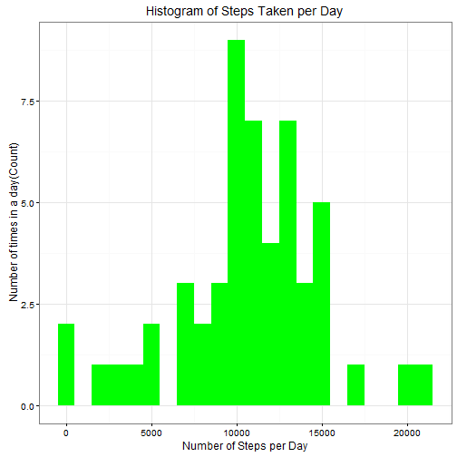
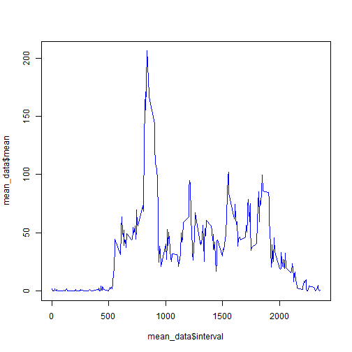
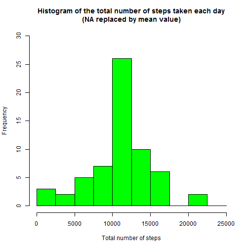
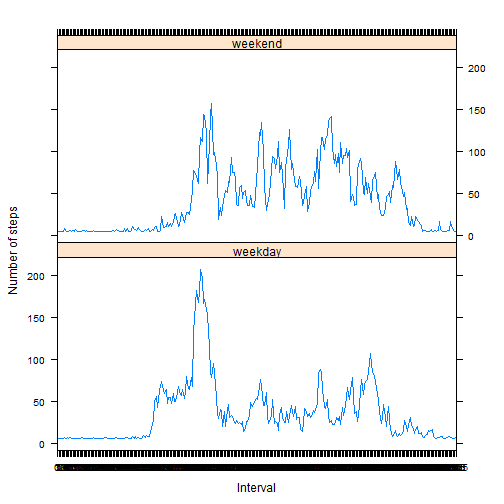

```r
library(knitr)
opts_chunk$set(echo = TRUE, results = 'hold')


library(data.table)
library(ggplot2)
```

---
title: "Reproducible Research: Peer Assessment 1"
output: 
  html_document:
    keep_md: true
---


## Loading and preprocessing the data


```r
setwd("G:/Github/RepData_PeerAssessment1")
unzip(zipfile="activity.zip")
data <- read.csv("activity.csv", header = TRUE, sep = ',', colClasses = c("numeric", "character", "integer"))
data$date <- as.Date(data$date, format = "%Y-%m-%d")
data$interval <- as.factor(data$interval)
data$weekday <- tolower(weekdays(data$date))
data$daytype <- ifelse(data$weekday == "saturday" | data$weekday == "sunday", "weekend", "weekday")
str(data)
```

```
## 'data.frame':	17568 obs. of  5 variables:
##  $ steps   : num  NA NA NA NA NA NA NA NA NA NA ...
##  $ date    : Date, format: "2012-10-01" "2012-10-01" ...
##  $ interval: Factor w/ 288 levels "0","5","10","15",..: 1 2 3 4 5 6 7 8 9 10 ...
##  $ weekday : chr  "monday" "monday" "monday" "monday" ...
##  $ daytype : chr  "weekday" "weekday" "weekday" "weekday" ...
```

## What is mean total number of steps taken per day?
###For this part of the assignment, you can ignore the missing values in the dataset.

###1.Calculate the total number of steps taken per day

```r
steps_per_day <- aggregate(steps ~ date, data, sum)
colnames(steps_per_day) <- c("date","steps")
head(steps_per_day)
```

```
##         date steps
## 1 2012-10-02   126
## 2 2012-10-03 11352
## 3 2012-10-04 12116
## 4 2012-10-05 13294
## 5 2012-10-06 15420
## 6 2012-10-07 11015
```

###2. Make a histogram of the total number of steps taken each day

```r
total.steps <- tapply(data$steps, data$date, FUN=sum, na.rm=TRUE)
ggplot(steps_per_day, aes(x = steps)) + 
       geom_histogram(fill = "green", binwidth = 1000) + 
        labs(title="Histogram of Steps Taken per Day", 
             x = "Number of Steps per Day", y = "Number of times in a day(Count)") + theme_bw() 
```



###3. Calculate and report the mean and median of the total number of steps taken per day

```r
mean(total.steps, na.rm=TRUE)
median(total.steps, na.rm=TRUE)
```

```
## [1] 9354.23
## [1] 10395
```
## What is the average daily activity pattern?
###1.Make a time series plot (i.e. type = "l") of the 5-minute interval (x-axis) and the average number of steps taken, averaged across all days (y-axis)

```r
mean_data <- aggregate(data$steps, 
                       by=list(data$interval), 
                       FUN=mean, 
                       na.rm=TRUE)

names(mean_data) <- c("interval", "mean")
head(mean_data)
```

```
##   interval      mean
## 1        0 1.7169811
## 2        5 0.3396226
## 3       10 0.1320755
## 4       15 0.1509434
## 5       20 0.0754717
## 6       25 2.0943396
```

```r
mean_data <- aggregate(data$steps, 
                      list(interval = as.numeric(as.character(data$interval))),
                      FUN = "mean",
                      na.rm=TRUE)


colnames(mean_data) <- c("interval", "mean")

plot(mean_data$interval, mean_data$mean, type="l", col="blue")
```



## Imputing missing values
###1.Calculate and report the total number of missing values in the dataset (i.e. the total number of rows with NAs)

```r
NA_count <- sum(is.na(data$steps))
NA_pos <- which(is.na(data$steps))
```
###2.Devise a strategy for filling in all of the missing values in the dataset.

```r
mean_vec <- rep(mean(data$steps, na.rm=TRUE), times=length(NA_pos))
```
###3.Create a new dataset that is equal to the original dataset but with the missing data filled in.

```r
data_NAN <- data
data_NAN[NA_pos, "steps"] <- mean_vec
head(data_NAN)
```

```
##     steps       date interval weekday daytype
## 1 37.3826 2012-10-01        0  monday weekday
## 2 37.3826 2012-10-01        5  monday weekday
## 3 37.3826 2012-10-01       10  monday weekday
## 4 37.3826 2012-10-01       15  monday weekday
## 5 37.3826 2012-10-01       20  monday weekday
## 6 37.3826 2012-10-01       25  monday weekday
```
###4. Make a histogram of the total number of steps taken each day and Calculate and report the mean and median total number of steps taken per day.

```r
agg_data <- aggregate(data_NAN$steps, by=list(data_NAN$date), FUN=sum)
names(agg_data) <- c("date", "total")

hist(agg_data$total, 
     breaks=seq(from=0, to=25000, by=2500),
     col="green", 
     xlab="Total number of steps", 
     ylim=c(0, 30), 
     main="Histogram of the total number of steps taken each day\n(NA replaced by mean value)")
```



```r
round(mean(agg_data$total))
round(median(agg_data$total))
```

```
## [1] 10766
## [1] 10766
```

## Are there differences in activity patterns between weekdays and weekends?


```r
agg <- aggregate(steps ~ interval + daytype, data=data_NAN, mean)
library(lattice)
xyplot(steps ~ interval | daytype, agg, 
       type="l", 
       lwd=1, 
       xlab="Interval", 
       ylab="Number of steps", 
       layout=c(1,2))
```



